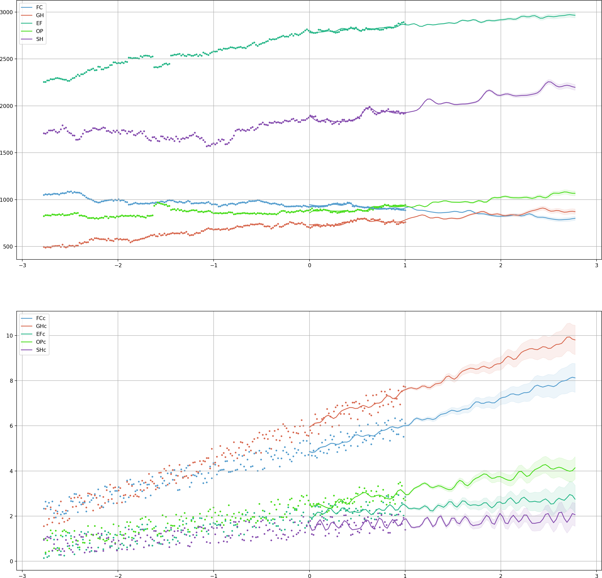
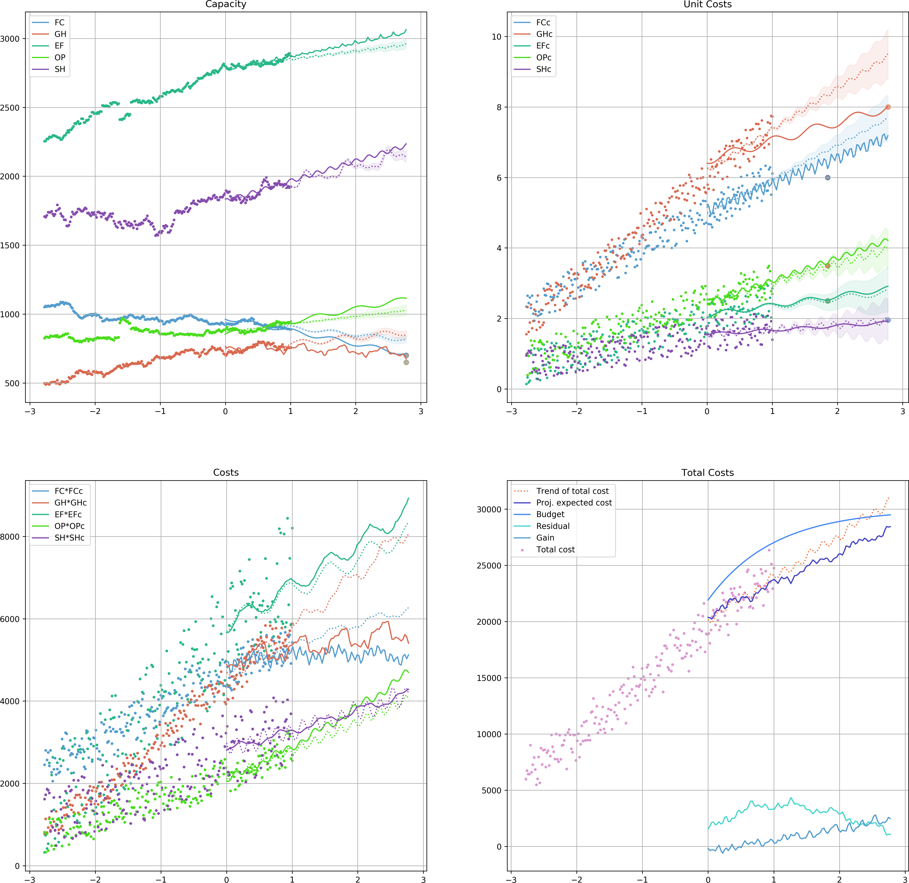

====================================
The Theory
====================================

Initial Motivation
====================================
This is mainly motivated by a problem regarding the Child and Family Service (CFS) in Saskatchewan, Canada. The CFS
provides services to families to prevent child maltreatment. Also, in case a mere service provision does not guarantee
child's safety, CFS should provide out of home alternative care. According to the circumstances and child's needs, a
child may be placed in one of the following types of care:

	+ Foster Care (FC)
	+ Group Home (GH)
	+ Extended Family (EF)
	+ Other (OP)

There are (variable) costs associated to each of these care groups as well as those who are receiving services at home
(SH) and
a budget that is allocated to the CFS at the beginning of the fiscal year.

Many possible scenarios are imaginable for willing to change the trend in a certain group and/or their associated cost
in a certain time frame. It might be easy to imagine how the bend in a trend may look like. It is very hard to imagine
how this change affects other trends.

Of course one can remove these names from groups or assign other meanings and interpretations to the abstract groups and
study a hypothetical scenario that fits this framework.
Let us denote various groups at time :math:`t` by :math:`G_1(t), G_2(t),\dots, G_n(t)` and their associated cost by
:math:`C_1(t), C_2(t),\dots, C_n(t)`.
Also, denote the available budget at time :math:`t` by :math:`B(t)`.
To tackle this problem, we are going to make a few assumptions:

	1. *The trend of the total capacity is invariant,* meaning that although we may be able to assume changes in
		each trend, but the total trend does not change.
		In symbols, if we introduce changes in certain group trends and they cause adjustments in other groups, i.e.,
		:math:`G_i(t)\rightarrow G_i'(t)`, the following holds:

		.. math::
			\sum_{i=1}^n G_i(t) \approx \sum_{i=1}^n G_i'(t).
			:label: genapprx

	2. *The associated costs to groups are independent.* A change in the cost of one group does not introduce changes
		in the costs of other groups, unless it is forced that at the end of trial period, we have a non-negative
		budget residual.

Referring to the CFS problem, it should be clear that the number of children who require assistance from CFS in any
form (i.e., services at home or kept at a place of safety) is independent from how CFS manages them (1).
Also, adjustment in the costs of a certain group does not induce a change in the associates costs of other groups (2).

A Non-Deterministic Approach
====================================
Since we are interested in the general trends of various groups of items, it should be clear that the problem and hence
any possible solutions mist likely live in a non-deterministic world. We are assuming that enough data points is
provided over a consistent period of time for all groups :math:`G_1,\dots, G_n` and their costs :math:`C_1,\dots, C_n`.
Suppose that we are willing to use Regressors :math:`\mathcal{R}_1` and :math:`\mathcal{R}_2` to approximate trends of
item groups and their costs, respectively, for a portion of time with available data, e.g, :math:`[0, T]`
[We prefer not to use all existing data point as in some cases a part of data maybe affected
by some protocols and policies that are not in effect anymore.].
In other words, the size of the item group $i$ at time $t$ can be approximated by

.. math::
	G_i(t)\approx\mathcal{R}_1[G_i](t),

and for its cost

.. math::
	C_i(t)\approx\mathcal{R}_2[C_i](t).

Suppose that the following changes are desirable:

.. math::
	G_{i_j}\mapsto G_{i_j}' \textrm{ where } G_{i_j}'(t_{i_j})\approx g_{i_j} \textrm{ for } j=1,\dots,m\leq n,
	:label: cndtn1

and

.. math::
	C_{i_k}\mapsto C'_{i_k} \textrm{ where } C'_{i_k}(t_{i_k})\approx c_{i_k} \textrm{ for } k=1,\dots,p\leq n.
	:label: cndtn2

A desirable change in the dynamics of the whole system that satisfies :eq:`cndtn1` and :eq:`cndtn2` should also
introduce a minimal error in the system. We may use the values of :math:`\mathcal{R}_1[G_i](t)` and
:math:`\mathcal{R}_1[G'_i](t)` to measure the introduced error.
Among various options, we assume that the introduced error is measured by

.. math::
	\mathcal{E}=\sqrt{\int_0^T\left(\mathcal{R}_1[G_i](t)-\mathcal{R}_1[G'_i](t)\right)^2~dt},

which is :math:`\ell_2` norm of the difference of two regressors over :math:`[0, T]`.

The available budget at time :math:`t` is :math:`B(t)-\sum_{i=1}^n(\mathcal{R}_1[G'_i](t)\times\mathcal{R}_2[C'_i](t))`.
So, the residual of the budget after the end of trial period (:math:`t=T_f`) is

.. math::
	\mathcal{S}=\int_{T_0}^{T_f}B(t)-\sum_{i=1}^n(\mathcal{R}_1[G'_i](t)\times\mathcal{R}_2[C'_i](t))~dt,

which is typically desired to be maximized. Also, an alternative of :eq:`genapprx` in terms of regressors should hold.
So, we are interested in the optimum solutions of the following problem:

.. math::
	\left\lbrace
	\begin{array}{lll}
		\min & \mathcal{E}-\mathcal{S} & \\
		\textrm{subject to} & & \\
		 & \mathcal{R}_1[G'_{i_j}](t_{i_j})=g_{i_j}, & j=1,\dots,m \\
		 & \mathcal{R}_1[C'_{i_k}](t_{i_k})=c_{i_k}, & k=1,\dots,p \\
		 & \sum_{i=1}^n\mathcal{R}_1[G_i](T_f) = \sum_{i=1}^n\mathcal{R}_1[G'_i](T_f),
	\end{array}
	\right.
    :label: optim

where the minimum is taken over all possible candidates for :math:`\mathcal{R}_1[G'_i]` and :math:`\mathcal{R}_2[C'_i]`,
:math:`i=1,\dots,n`.

Moreover, one may wishes that the residual at the end of trial period is non-negative. This adds the following extra
constraint :eq:`cnstrnt` to :eq:`optim`:

.. math::
	B(T_f) - \sum_{i=1}^n\mathcal{R}_1[G'_i](T_f)\times\mathcal{R}_2[C'_i](T_f) \ge 0.
    :label: cnstrnt

Enforcing Conditions on Regressors
======================================
To convince the regressors lean toward the values given on :eq:`cndtn1` and :eq:`cndtn2`, we employ a Monte Carlo type
of approach. Assuming that

.. math::
	G_i(t)-\mathcal{R}_1[G_i](t)\sim\mathcal{N}(0, \sigma_i),

to handle the constraint :math:`\mathcal{R}_1[G'_{i_j}](t_{i_j})=g_{i_j}` we produce a random sample for a given period
before and after time :math:`t_{i_j}` drawn from the distribution :math:`\mathcal{N}(g_{i_j}, \sigma_i)` and incorporate
this artificial sample to our training data.
This guarantees that :math:`\mathcal{R}[G'_{i_j}]` leans toward :math:`g_{i_j}` around time :math:`t=t_{i_j}`.

The strength of this bend is directly correlated to *the size of the sample and the value of* :math:`\sigma_i`.
To make sure that the size of the sample is suitable, one can use a minimum number of sampled by default and use a
ratio to estimate the maximum size of the sample [we will use the probability designated to determine
confidence intervals as the default value for the ratio].
We repeat the same trick to handle the constraints of the form :math:`\mathcal{R}_2[C'_{i_k}](t_{i_k})=c_{i_k}`.

The set of constraints :math:`\mathcal{R}_1[G'_{i_j}](t_{i_j})=g_{i_j}` determines the projected values of the
corresponding items at time :math:`t=T_f`, trying to modify the ultimate values of these regressions for :math:`t=T_f`
clearly increases the value of :math:`\mathcal{E}`.
So, we choose to relax the regressors to find their final values. For those indices :math:`i\not\in\{i_1,\dots,i_m\}`,
we select candidate values :math:`\tilde{g}_i` such that

.. math::
	\sum_{i=1}^n\mathcal{R}_1[G_i](T_f) = \sum_{j=1}^k\mathcal{R}_1[G'_{i_j}](T_f)+\sum_{i\not\in\{i_1,\dots,i_m\}}\tilde{g}_i.
    :label: alt-cnstrnt

This reduces solving :eq:`optim` to finding best candidates for :math:`\tilde{g}_i`, :math:`i\not\in\{i_1,\dots,i_m\}`
that minimizes the objective of :eq:`optim` and satisfies :eq:`alt-cnstrnt`.
Algorithm summarizes this procedure.

Example
======================
To see the algorithm in action we use the CFS' data with hypothetical data for the corresponding costs and budget.
Next table provides a few samples from data. The `ds` ranges from January 1th, 2015 to
January 1th, 2019. We chose the last year of the data to base the analysis on and project trends for
January 11th, 2021.

==========  ====  ====  ====  ====  ====  =======  =======  ========  =======  ========
 ds          FC    GH    EF    OP    SH      FCc      GHc       EFc      OPc       SHc
==========  ====  ====  ====  ====  ====  =======  =======  ========  =======  ========
2018-08-30   924   780  2816   880  1969  5.97549  6.48204  1.98615   2.86382  1.77176
2017-12-21   927   712  2816   885  1863  4.63028  5.83286  2.42853   2.68884  1.60908
2016-10-13   968   666  2536   876  1660  4.06597  4.22486  1.77068   1.82547  1.34815
2017-06-08   993   744  2655   854  1802  4.89702  4.77482  1.39608   1.91099  0.931255
2015-12-17   948   565  2515   827  1729  3.17565  3.0835   0.831563  1.85582  1.04643
==========  ====  ====  ====  ====  ====  =======  =======  ========  =======  ========

The following figure shows the data points and their trends estimated based on a Fourier transform.

Then we set the following constraints for points at time in future:

	+ 650 for `G` at January 1th, 2021
	+ 700 for `FC` at January 1th, 2021
	+ 6.0 for `FCc` at January 1th, 2020
	+ 8.0 for `GCc` at January 1th, 2021
	+ 2.5 for `EFc` at January 1th, 2020
	+ 3.5 for `OPc` at January 1th, 2020

Assuming that the DataFrame `df` is already set, the following piece of code sets up and runs the analysis::

    # initiated df
    pairs= [('FC', 'FCc'), ('GH', 'GHc'), ('EF', 'EFc'), ('OP', 'OPc'), ('SH', 'SHc')]
    # define regressors
    from NpyProximation import HilbertRegressor
    from numpy import sin, cos, exp
    deg = 5
    skip = 1
    l = 0.1
    base = [lambda x: 1., lambda x: x[0]] + \
        [lambda x, l=l, _=_: sin(_*x[0]/l) for _ in range(1, deg+1, skip)] + \
        [lambda x, l=l, _=_: cos(_*x[0]/l) for _ in range(1, deg+1, skip)]
    regressor = HilbertRegressor(base=base)
    # initialize
    s_date = datetime(year=2018, month=1, day=1)
    instance = InventoryOpt(df, date_fld='ds', units_costs=pairs, start_date=s_date,
                num_intrvl=(0., 1.), projection_date=datetime(year=2021, month=1, day=1),
                c_limit=.95)
    instance.set_unit_count_regressor(regressor)
    instance.set_cost_regressor(regressor)
    instance.fit_regressors()
    instance.plot_init_system().savefig('init.png', dpi=200)
    instance.budget = lambda t: 30000-22000*exp(-t-1.)
    # constraints
    instance.constraint('GH', 650, datetime(year=2021, month=1, day=1))
    instance.constraint('FC', 700, datetime(year=2021, month=1, day=1))
    instance.constraint('FCc', 6., datetime(year=2020, month=1, day=1))
    instance.constraint('GHc', 8., datetime(year=2021, month=1, day=1))
    instance.constraint('EFc', 2.5, datetime(year=2020, month=1, day=1))
    instance.constraint('OPc', 3.5, datetime(year=2020, month=1, day=1))
    # run
    instance.adjust_system(tbo='b')
    fig = instance.plot_analysis()

After running the analysis, the followin figure would be the outcome.

Note that in some cases the solver was not able to perfectly match the suggested value at the specific time.
This is due to the stochastic nature of the problem and the provided solution.
